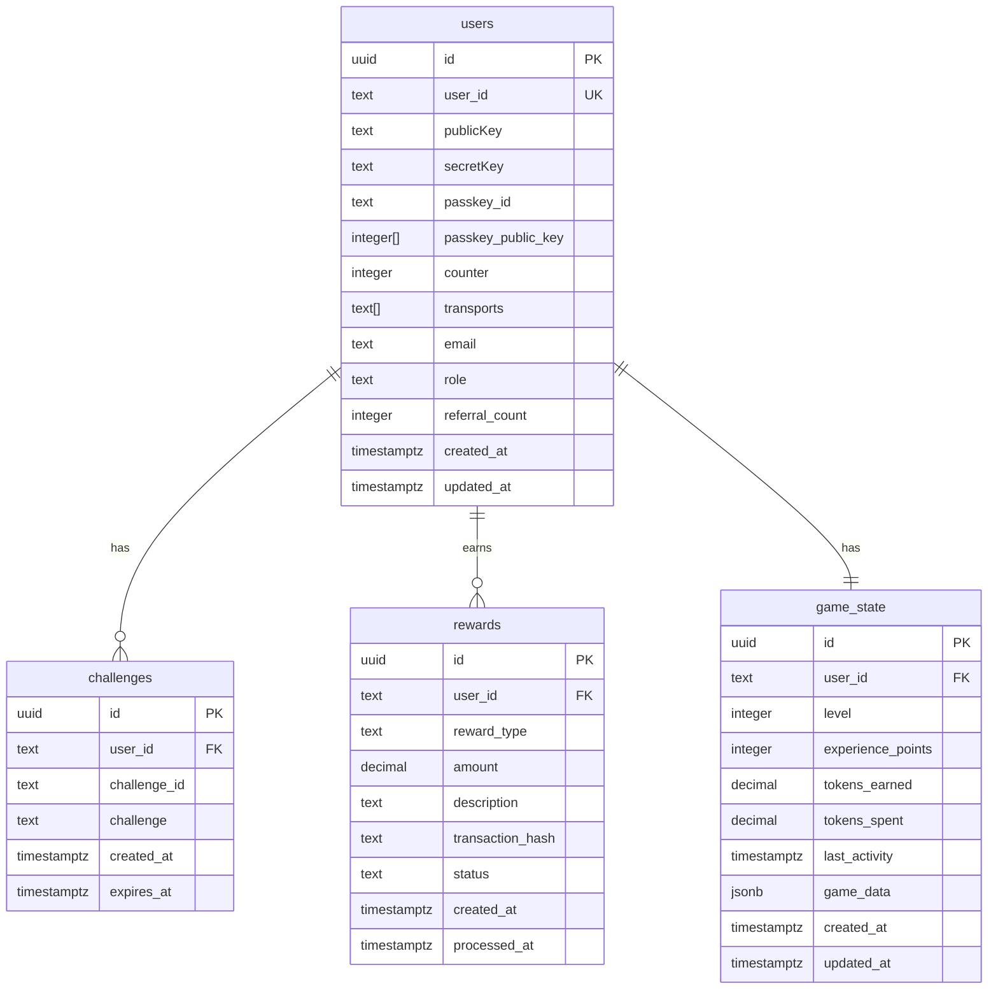

# Database Schema

> **Complete database structure for ZI Playground**  
> **Last Updated:** January 21, 2025

---

## 🗄️ Overview

ZI Playground uses Supabase PostgreSQL database with the following core tables:
- **users** - User accounts with passkey authentication and Stellar integration
- **challenges** - WebAuthn challenges for passkey authentication
- **rewards** (planned) - User rewards and referral system
- **game_state** (planned) - Game progress and user activities

---

## 📋 Tables

### users
**Purpose:** Core user accounts with passkey authentication and Stellar blockchain integration

```sql
CREATE TABLE users (
  id UUID DEFAULT gen_random_uuid() PRIMARY KEY,
  user_id TEXT UNIQUE NOT NULL,
  "publicKey" TEXT,
  "secretKey" TEXT,
  passkey_id TEXT,
  passkey_public_key INTEGER[],
  counter INTEGER DEFAULT 0,
  transports TEXT[],
  email TEXT,
  role TEXT DEFAULT 'user',
  referral_count INTEGER DEFAULT 0,
  created_at TIMESTAMP WITH TIME ZONE DEFAULT NOW(),
  updated_at TIMESTAMP WITH TIME ZONE DEFAULT NOW()
);
```

#### Columns
| Column | Type | Description | Constraints |
|--------|------|-------------|-------------|
| `id` | UUID | Primary key, auto-generated | PRIMARY KEY |
| `user_id` | TEXT | Unique user identifier for passkeys | UNIQUE, NOT NULL |
| `publicKey` | TEXT | Stellar account public key | - |
| `secretKey` | TEXT | Encrypted Stellar account secret key | - |
| `passkey_id` | TEXT | WebAuthn credential ID | - |
| `passkey_public_key` | INTEGER[] | WebAuthn public key as integer array | - |
| `counter` | INTEGER | WebAuthn signature counter (replay protection) | DEFAULT 0 |
| `transports` | TEXT[] | WebAuthn authenticator transports | - |
| `email` | TEXT | User email address (optional) | - |
| `role` | TEXT | User role (user/admin) | DEFAULT 'user' |
| `referral_count` | INTEGER | Number of successful referrals | DEFAULT 0 |
| `created_at` | TIMESTAMPTZ | Account creation timestamp | DEFAULT NOW() |
| `updated_at` | TIMESTAMPTZ | Last update timestamp | DEFAULT NOW() |

#### Indexes
```sql
CREATE INDEX IF NOT EXISTS idx_users_user_id ON users(user_id);
CREATE INDEX IF NOT EXISTS idx_users_publickey ON users("publicKey");
CREATE INDEX IF NOT EXISTS idx_users_passkey_id ON users(passkey_id);
CREATE INDEX IF NOT EXISTS idx_users_created_at ON users(created_at);
```

#### Constraints
```sql
ALTER TABLE users ADD CONSTRAINT users_user_id_unique UNIQUE (user_id);
ALTER TABLE users ADD CONSTRAINT users_role_check CHECK (role IN ('user', 'admin', 'moderator'));
```

---

### challenges
**Purpose:** Temporary storage for WebAuthn authentication challenges

```sql
CREATE TABLE challenges (
  id UUID DEFAULT gen_random_uuid() PRIMARY KEY,
  user_id TEXT,
  challenge_id TEXT,
  challenge TEXT NOT NULL,
  created_at TIMESTAMP WITH TIME ZONE DEFAULT NOW(),
  expires_at TIMESTAMP WITH TIME ZONE DEFAULT NOW() + INTERVAL '5 minutes'
);
```

#### Columns
| Column | Type | Description | Constraints |
|--------|------|-------------|-------------|
| `id` | UUID | Primary key, auto-generated | PRIMARY KEY |
| `user_id` | TEXT | Reference to users.user_id | - |
| `challenge_id` | TEXT | Unique challenge identifier | - |
| `challenge` | TEXT | WebAuthn challenge string | NOT NULL |
| `created_at` | TIMESTAMPTZ | Challenge creation time | DEFAULT NOW() |
| `expires_at` | TIMESTAMPTZ | Challenge expiration time | DEFAULT NOW() + 5 minutes |

#### Indexes
```sql
CREATE INDEX IF NOT EXISTS idx_challenges_user_id ON challenges(user_id);
CREATE INDEX IF NOT EXISTS idx_challenges_challenge_id ON challenges(challenge_id);
CREATE INDEX IF NOT EXISTS idx_challenges_expires_at ON challenges(expires_at);
```

#### Cleanup Policy
```sql
-- Automatic cleanup of expired challenges
CREATE OR REPLACE FUNCTION cleanup_expired_challenges()
RETURNS void AS $$
BEGIN
  DELETE FROM challenges WHERE expires_at < NOW();
END;
$$ LANGUAGE plpgsql;

-- Schedule cleanup every hour (requires pg_cron extension)
-- SELECT cron.schedule('cleanup-challenges', '0 * * * *', 'SELECT cleanup_expired_challenges();');
```

---

## 🚧 Planned Tables

### rewards
**Purpose:** Track user rewards and referral system

```sql
CREATE TABLE rewards (
  id UUID DEFAULT gen_random_uuid() PRIMARY KEY,
  user_id TEXT REFERENCES users(user_id),
  reward_type TEXT NOT NULL,
  amount DECIMAL(20,7) DEFAULT 0,
  description TEXT,
  transaction_hash TEXT,
  status TEXT DEFAULT 'pending',
  created_at TIMESTAMP WITH TIME ZONE DEFAULT NOW(),
  processed_at TIMESTAMP WITH TIME ZONE
);
```

#### Planned Columns
| Column | Type | Description | Constraints |
|--------|------|-------------|-------------|
| `id` | UUID | Primary key | PRIMARY KEY |
| `user_id` | TEXT | Reference to users.user_id | FOREIGN KEY |
| `reward_type` | TEXT | Type of reward (referral, game, bonus) | NOT NULL |
| `amount` | DECIMAL | Reward amount in tokens | DEFAULT 0 |
| `description` | TEXT | Human-readable description | - |
| `transaction_hash` | TEXT | Stellar transaction hash | - |
| `status` | TEXT | pending/processed/failed | DEFAULT 'pending' |
| `created_at` | TIMESTAMPTZ | Reward creation time | DEFAULT NOW() |
| `processed_at` | TIMESTAMPTZ | When reward was processed | - |

---

### game_state
**Purpose:** Store user game progress and activities

```sql
CREATE TABLE game_state (
  id UUID DEFAULT gen_random_uuid() PRIMARY KEY,
  user_id TEXT REFERENCES users(user_id),
  level INTEGER DEFAULT 1,
  experience_points INTEGER DEFAULT 0,
  tokens_earned DECIMAL(20,7) DEFAULT 0,
  tokens_spent DECIMAL(20,7) DEFAULT 0,
  last_activity TIMESTAMP WITH TIME ZONE DEFAULT NOW(),
  game_data JSONB DEFAULT '{}',
  created_at TIMESTAMP WITH TIME ZONE DEFAULT NOW(),
  updated_at TIMESTAMP WITH TIME ZONE DEFAULT NOW()
);
```

#### Planned Columns
| Column | Type | Description | Constraints |
|--------|------|-------------|-------------|
| `id` | UUID | Primary key | PRIMARY KEY |
| `user_id` | TEXT | Reference to users.user_id | FOREIGN KEY |
| `level` | INTEGER | User's game level | DEFAULT 1 |
| `experience_points` | INTEGER | Total XP earned | DEFAULT 0 |
| `tokens_earned` | DECIMAL | Total tokens earned | DEFAULT 0 |
| `tokens_spent` | DECIMAL | Total tokens spent | DEFAULT 0 |
| `last_activity` | TIMESTAMPTZ | Last game activity | DEFAULT NOW() |
| `game_data` | JSONB | Flexible game state storage | DEFAULT '{}' |
| `created_at` | TIMESTAMPTZ | Record creation time | DEFAULT NOW() |
| `updated_at` | TIMESTAMPTZ | Last update time | DEFAULT NOW() |

---

## 🔐 Security Considerations

### Row Level Security (RLS)
```sql
-- Enable RLS on sensitive tables
ALTER TABLE users ENABLE ROW LEVEL SECURITY;
ALTER TABLE challenges ENABLE ROW LEVEL SECURITY;
ALTER TABLE rewards ENABLE ROW LEVEL SECURITY;
ALTER TABLE game_state ENABLE ROW LEVEL SECURITY;

-- Users can only access their own data
CREATE POLICY "Users can view own data" ON users
  FOR SELECT USING (auth.uid()::text = user_id);

CREATE POLICY "Users can update own data" ON users
  FOR UPDATE USING (auth.uid()::text = user_id);

-- Challenges are temporary and cleaned up automatically
CREATE POLICY "Users can manage own challenges" ON challenges
  FOR ALL USING (user_id = auth.uid()::text);

-- Rewards are read-only for users
CREATE POLICY "Users can view own rewards" ON rewards
  FOR SELECT USING (user_id = auth.uid()::text);

-- Game state is user-specific
CREATE POLICY "Users can manage own game state" ON game_state
  FOR ALL USING (user_id = auth.uid()::text);
```

### Data Encryption
- **Secret Keys:** Stellar secret keys should be encrypted before storage
- **Sensitive Data:** Consider encrypting PII fields
- **Connection Security:** All connections use SSL/TLS

---

## 📊 Relationships



---

## 🔧 Setup Commands

### Initial Database Setup
```sql
-- Create users table with all required columns
CREATE TABLE IF NOT EXISTS users (
  id UUID DEFAULT gen_random_uuid() PRIMARY KEY,
  user_id TEXT UNIQUE NOT NULL,
  "publicKey" TEXT,
  "secretKey" TEXT,
  passkey_id TEXT,
  passkey_public_key INTEGER[],
  counter INTEGER DEFAULT 0,
  transports TEXT[],
  email TEXT,
  role TEXT DEFAULT 'user',
  referral_count INTEGER DEFAULT 0,
  created_at TIMESTAMP WITH TIME ZONE DEFAULT NOW(),
  updated_at TIMESTAMP WITH TIME ZONE DEFAULT NOW()
);

-- Create challenges table
CREATE TABLE IF NOT EXISTS challenges (
  id UUID DEFAULT gen_random_uuid() PRIMARY KEY,
  user_id TEXT,
  challenge_id TEXT,
  challenge TEXT NOT NULL,
  created_at TIMESTAMP WITH TIME ZONE DEFAULT NOW(),
  expires_at TIMESTAMP WITH TIME ZONE DEFAULT NOW() + INTERVAL '5 minutes'
);

-- Create indexes for performance
CREATE INDEX IF NOT EXISTS idx_users_user_id ON users(user_id);
CREATE INDEX IF NOT EXISTS idx_users_publickey ON users("publicKey");
CREATE INDEX IF NOT EXISTS idx_users_passkey_id ON users(passkey_id);
CREATE INDEX IF NOT EXISTS idx_users_created_at ON users(created_at);
CREATE INDEX IF NOT EXISTS idx_challenges_user_id ON challenges(user_id);
CREATE INDEX IF NOT EXISTS idx_challenges_challenge_id ON challenges(challenge_id);
CREATE INDEX IF NOT EXISTS idx_challenges_expires_at ON challenges(expires_at);

-- Add constraints
ALTER TABLE users ADD CONSTRAINT users_user_id_unique UNIQUE (user_id);
ALTER TABLE users ADD CONSTRAINT users_role_check CHECK (role IN ('user', 'admin', 'moderator'));
```

### Future Tables Setup
```sql
-- Rewards table (when implementing rewards system)
CREATE TABLE IF NOT EXISTS rewards (
  id UUID DEFAULT gen_random_uuid() PRIMARY KEY,
  user_id TEXT REFERENCES users(user_id),
  reward_type TEXT NOT NULL,
  amount DECIMAL(20,7) DEFAULT 0,
  description TEXT,
  transaction_hash TEXT,
  status TEXT DEFAULT 'pending',
  created_at TIMESTAMP WITH TIME ZONE DEFAULT NOW(),
  processed_at TIMESTAMP WITH TIME ZONE
);

-- Game state table (when implementing game logic)
CREATE TABLE IF NOT EXISTS game_state (
  id UUID DEFAULT gen_random_uuid() PRIMARY KEY,
  user_id TEXT REFERENCES users(user_id),
  level INTEGER DEFAULT 1,
  experience_points INTEGER DEFAULT 0,
  tokens_earned DECIMAL(20,7) DEFAULT 0,
  tokens_spent DECIMAL(20,7) DEFAULT 0,
  last_activity TIMESTAMP WITH TIME ZONE DEFAULT NOW(),
  game_data JSONB DEFAULT '{}',
  created_at TIMESTAMP WITH TIME ZONE DEFAULT NOW(),
  updated_at TIMESTAMP WITH TIME ZONE DEFAULT NOW()
);
```

---

## 📈 Performance Optimization

### Query Optimization
```sql
-- Composite indexes for common queries
CREATE INDEX IF NOT EXISTS idx_users_composite ON users(user_id, created_at);
CREATE INDEX IF NOT EXISTS idx_challenges_cleanup ON challenges(expires_at) WHERE expires_at < NOW();

-- Partial indexes for active records
CREATE INDEX IF NOT EXISTS idx_users_active ON users(user_id) WHERE role = 'user';
```

### Maintenance Tasks
```sql
-- Update updated_at timestamp trigger
CREATE OR REPLACE FUNCTION update_updated_at_column()
RETURNS TRIGGER AS $$
BEGIN
    NEW.updated_at = NOW();
    RETURN NEW;
END;
$$ language 'plpgsql';

-- Apply to relevant tables
CREATE TRIGGER update_users_updated_at BEFORE UPDATE ON users
    FOR EACH ROW EXECUTE FUNCTION update_updated_at_column();

CREATE TRIGGER update_game_state_updated_at BEFORE UPDATE ON game_state
    FOR EACH ROW EXECUTE FUNCTION update_updated_at_column();
```

---

## 🧪 Sample Data

### Test Users
```sql
-- Insert sample test user (for development only)
INSERT INTO users (user_id, "publicKey", email, role) VALUES
('test-user-123', 'GCTZW4APT7AMBUYJ67PSOYG4T6STIFQW2VDRRTXPJXGZFGKQZEUHDDCO', 'test@example.com', 'user')
ON CONFLICT (user_id) DO NOTHING;
```

### Test Queries
```sql
-- Verify user creation
SELECT user_id, "publicKey", created_at FROM users LIMIT 5;

-- Check active challenges
SELECT user_id, challenge_id, expires_at FROM challenges WHERE expires_at > NOW();

-- User statistics
SELECT 
  COUNT(*) as total_users,
  COUNT(*) FILTER (WHERE created_at > NOW() - INTERVAL '24 hours') as new_today
FROM users;
```

---

## 🔍 Monitoring & Analytics

### Useful Views
```sql
-- User activity summary
CREATE OR REPLACE VIEW user_activity_summary AS
SELECT 
  u.user_id,
  u.created_at as registered_at,
  u.referral_count,
  COUNT(c.id) as active_challenges
FROM users u
LEFT JOIN challenges c ON c.user_id = u.user_id AND c.expires_at > NOW()
GROUP BY u.user_id, u.created_at, u.referral_count;

-- System health metrics
CREATE OR REPLACE VIEW system_health AS
SELECT 
  'users' as table_name,
  COUNT(*) as record_count,
  MAX(created_at) as latest_record
FROM users
UNION ALL
SELECT 
  'challenges' as table_name,
  COUNT(*) as record_count,
  MAX(created_at) as latest_record
FROM challenges;
```

---

## 📚 Migration History

### Version 1.0.0 - Initial Schema
- ✅ Created `users` table with passkey authentication fields
- ✅ Created `challenges` table for WebAuthn flow
- ✅ Added all necessary indexes and constraints
- ✅ Implemented Row Level Security policies

### Version 1.1.0 - Planned Enhancements
- 🚧 Add `rewards` table for user incentives
- 🚧 Add `game_state` table for game progress
- 🚧 Implement automated cleanup procedures
- 🚧 Add comprehensive analytics views

---

## ✅ Current Status

### ✅ Production Ready
- **users** table - Complete with all authentication fields
- **challenges** table - Functional WebAuthn challenge storage
- **Indexes** - All performance indexes created
- **Security** - RLS policies implemented
- **Constraints** - Data integrity ensured

### 🚧 In Development
- **rewards** table - Schema designed, implementation pending
- **game_state** table - Schema designed, implementation pending
- **Analytics views** - Basic monitoring queries ready
- **Automated maintenance** - Cleanup procedures designed

---

**Last Updated:** January 21, 2025  
**Version:** 1.0.0  
**Status:** Production ready for authentication, rewards system pending ✅

For setup instructions, see [Installation Guide](../setup/installation.md).  
For troubleshooting database issues, see [Issues Resolved](../development/issues-resolved.md).